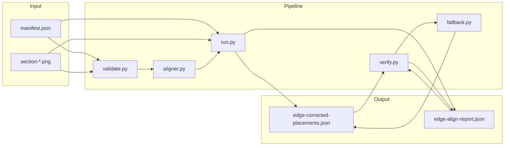
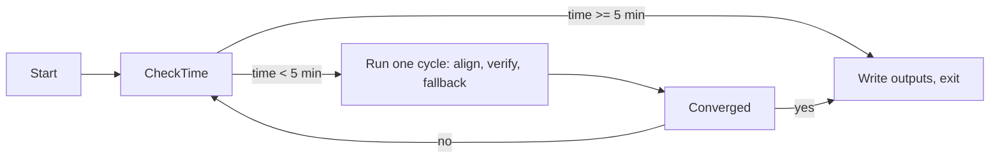
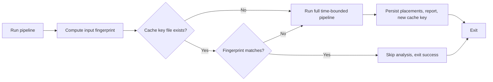

# Edge-matching section assembly — full system plan

This document is the single source of truth for the edge-matching section assembly system: alignment, verification, fallback, edge-case handling, and modular script layout. Implement all details here so the system works locally and is easy to mutate, remove, or replace by file.

---

## 1. Overview and goals

**Goal:** For every painting made of multiple sections, run **edge matching** at build/authoring time so that wherever two section images meet, their boundary strips are compared with a **sliding window** (50–100 px), matches within a **25% margin of error** are accepted, and **corrected positions** are written. The site then uses these when available so the final assembled image is as close as possible to a seamless whole, with the original vision of how sections connect preserved.

**Principles:**

- One main function per script; filesystem mutable (placements and reports in separate files, removable/replaceable).
- As many cycles as needed: align → verify → optionally fallback when confidence is low.
- No guarantee that section images are “brain oriented” from the source; support **rotation_degrees** and a **verification + fallback** layer when the primary pass does not work well.

---

## 2. Current state

- **Stack:** Next.js, React, TypeScript; Python used only for the edge-align pipeline (no Python in app runtime).
- **Data:** Each painting has `source_images/<id>/manifest.json` (sections, `origin_x`/`origin_y`, `output_width_px`/`output_height_px`, `layout.section_relations`: left_of, right_of, above, below) and `source_images/<id>/section-*.png`. Placements are computed in [lib/symmetry-layout.ts](lib/symmetry-layout.ts); [components/PaintingAssembly.tsx](components/PaintingAssembly.tsx) positions section images. [lib/manifest.ts](lib/manifest.ts) provides `getEdgeCorrectedPlacements(paintingId)` and the app uses `computeEdgeCorrectedLayout(manifest, edgeCorrected)` when edge-corrected file exists.
- **Gap:** Without edge-align, positions come only from manifest; there is no image-based verification, no orientation handling, and no explicit verification/fallback when alignment is poor.

---

## 3. Architecture



- **Where it runs:** Build/authoring time (not in the browser). Run once per painting when sections or manifest change; optionally re-run verify and fallback in a second cycle.
- **Input:** `source_images/<id>/manifest.json`, `source_images/<id>/section-*.png`.
- **Output:**  
  - `edge-corrected-placements.json` — section index → `{ origin_x, origin_y }` (removable; when missing, app uses manifest).  
  - `edge-align-report.json` (optional) — per-seam scores, confidence, timestamp; used by verify and fallback.

---

## 4. Core algorithm (per-seam and global)

**Constants (hard-coded):**

- **Margin of error:** 25% → accept match if correlation score ≥ 0.75; search range along seam ±25% of overlap length.
- **Strip / window:** Strip width 50–100 px; sliding step 50 px (min 50 or 100 as in plan).

**Per-seam:**

1. Enumerate seams from `section_relations`: right_of → (A_right, B_left); left_of, below, above similarly; dedupe by (section_a, section_b).
2. Load both section images (grayscale, float [0,1]). If `rotation_degrees` != 0, rectify (rotate section so output is axis-aligned in source space) before extracting strips.
3. Extract boundary strips (left/right/top/bottom) of width 50–100 px; convert to 1D signal along seam (average across strip).
4. Sliding window: slide one strip along the other in steps of 50 px, search ±25% of overlap; compute normalized cross-correlation at each offset.
5. Best offset and score: if score ≥ 0.75, record SeamResult (axis, delta); else reject seam.
6. Repeat for every seam.

**Global:**

- Aggregate seam results: pos_b = pos_a + base_offset(a,b) + delta; start from manifest positions; iterate constraints (average when multiple); clamp to canvas. Output (origin_x, origin_y) per section.
- Write `edge-corrected-placements.json`. Optionally write `edge-align-report.json` with per-seam scores and counts for verify.

---

## 5. Technology

- **Python 3** with **opencv-python**, **numpy**, **scipy** (scripts/edge_align_sections/requirements.txt).
- **Node/tsx** runners that call Python scripts (scripts/edge-align.ts, scripts/edge-align-verify.ts, scripts/edge-align-fallback.ts).
- Layout: [lib/symmetry-layout.ts](lib/symmetry-layout.ts) `computeEdgeCorrectedLayout(manifest, edgeCorrectedPlacements)`; app reads placements via [lib/manifest.ts](lib/manifest.ts) `getEdgeCorrectedPlacements`.

---

## 6. Orientation and rotation

- **Convention:** Section PNGs are assumed to be axis-aligned with source (image left = source left) unless manifest says otherwise. The manifest has `rotation_degrees` and `corners` per section.
- **Handling:** In the aligner, when loading a section image, if `rotation_degrees` != 0, rotate the image by `-rotation_degrees` (e.g. OpenCV) so that the section is rectified before strip extraction. Then “left”/“right”/“top”/“bottom” in the code match source-space edges. If rotation is non-zero and rectification is not implemented, log a warning and skip edge-align for that section or painting.
- **No runtime guarantee:** The system does not verify that the source image was unchanged after sections were cut; low correlation will cause seams to be rejected or confidence to be low and fallback to manifest.

---

## 7. Verification and fallback (secondary logic)

**Purpose:** When the primary alignment “doesn’t work well,” the system should not trust corrections; it should fall back to manifest-only layout.

**Verification (verify.py):**

- Input: manifest, `edge-corrected-placements.json`, section images (or stored report with per-seam scores).
- Re-evaluate each seam that was used: at the chosen offset, recompute correlation (or use score from run). Count seams with score ≥ 0.75 vs total seams.
- Compute **confidence:** e.g. `high` if ≥ 50% of seams pass and mean score ≥ 0.7; else `low`. Write or update `edge-align-report.json` with `confidence`, per-seam pass/fail, optional timestamp.

**Fallback (fallback.py):**

- Input: `edge-align-report.json` (or confidence from verify).
- If confidence is `low`: either **delete** `edge-corrected-placements.json` (so app uses manifest) or **add** to the placements file (or report) a field `"confidence": "low"` and have the app ignore corrections when that flag is set. Prefer delete so the app needs no change.
- If confidence is `high`: leave placements as-is; optionally ensure report says `confidence: high` for auditing.

**Execution order (cycles):**

1. **Cycle 1 — Align:** Run `run.py` for each painting → write `edge-corrected-placements.json` (+ optional report with raw scores).
2. **Cycle 2 — Verify:** Run `verify.py` for each painting that has placements → update `edge-align-report.json` with confidence and per-seam results.
3. **Cycle 3 — Fallback:** Run `fallback.py` for each painting with report; if confidence low, remove (or flag) `edge-corrected-placements.json`.

Runners: `edge-align.ts` (align), `edge-align-verify.ts` (verify), `edge-align-fallback.ts` (fallback). Each can be run independently so the filesystem is mutable and replaceable.

---

## 8. Edge cases — complete list and handling

Each case is handled by one or more scripts; the filesystem stays mutable (remove placements or report to reset behavior).

### A. Input / manifest

| Case | Handling |
|------|----------|
| Empty or missing manifest | validate.py or run.py: fail with clear error; do not write output. |
| Single-section painting | aligner: return identity positions; run.py writes placements (optional) or skip writing. |
| Empty section_relations | aligner: return manifest positions; run.py can skip writing or write identity. |
| Missing section image | aligner/run: skip that section or seam; continue with others; log. |
| Manifest / image mismatch (e.g. section-2 missing) | Skip seams involving missing section; log; continue. |
| Corrupt or unreadable image | Skip section; log; continue; do not crash. |
| Zero or negative dimensions | Skip section or seam; validate.py can reject manifest. |
| Section index gaps (e.g. 0, 2, 5) | Key by index everywhere; do not assume 0..N-1. |
| Duplicate section indices in manifest | Treat as invalid in validate or use first and warn. |

### B. Orientation / geometry

| Case | Handling |
|------|----------|
| Non-zero rotation_degrees | Rectify section image before strip extraction (rotate by -rotation_degrees); or skip/warn and do not use wrong edges. |
| Skewed / non-rectangular quads | Optional: use corners to warp to rect; otherwise assume PNG is already rectified. |
| Very small section (e.g. &lt; 50 px on one axis) | Reduce strip width to fit or skip seam; never exceed section size. |
| Very large section | Optional: downscale for matching only to limit memory/time. |

### C. Seam matching

| Case | Handling |
|------|----------|
| No overlap (strip length too small) | Skip seam; do not record result. |
| Low correlation (score &lt; 0.75) | Reject seam (do not add to SeamResult list). |
| All seams rejected | Output manifest-only positions; run.py can skip writing placements or write identity; verify will mark low confidence. |
| Conflicting constraints (different positions for same section) | Aggregation averages; optional: set conflict flag in report. |
| Search range too small (e.g. ±25% &lt; 1 px) | Still run with step 1 or skip seam; document rule. |
| Strip width &gt; section size | Clamp strip to section dimensions (already in place). |

### D. Output / integration

| Case | Handling |
|------|----------|
| No edge-corrected file written | App uses manifest-only (getEdgeCorrectedPlacements returns null). |
| Stale edge-corrected file (manifest/sections changed) | Optional: store manifest hash or version in report; fallback or separate script can remove stale placements. |
| Partial corrections (only some sections) | Layout uses corrections where present, manifest elsewhere (current behavior). |
| Invalid JSON or schema in placements | App validate and fall back to null (use manifest). |

### E. Environment / runtime

| Case | Handling |
|------|----------|
| Python or deps missing | Node runner checks for python3 and fails with clear message; document pip install in README. |
| No write permission to source_images/&lt;id&gt;/ | run.py/verify.py/fallback.py fail with clear error. |
| Disk full | Catch write errors; report. |
| Wrong working directory | Use explicit paths (e.g. --source, REPO_ROOT); document run from repo root. |

### F. Verification / confidence

| Case | Handling |
|------|----------|
| Low confidence (few seams pass or low mean score) | verify.py sets confidence: low; fallback.py removes (or flags) placements. |
| High confidence | Leave placements; report confidence: high. |

### G. Optional extras

| Case | Handling |
|------|----------|
| Flipped/mirrored section | Optional: try matching with one strip flipped; pick best score (orientation-agnostic fallback). |
| Heavy compression or noise | Optional: denoise or use edge/gradient features (Canny/Sobel) for correlation. |
| Duplicate seams in relations | Dedupe by (i,j) so each seam processed once (already in place). |

---

## 9. Modular scripts and file layout

**Rule:** One main function per script; outputs in separate files so the filesystem is mutable, removable, and replaceable.

### Directory layout

```
scripts/
  edge_align_sections/
    requirements.txt       # opencv-python, numpy, scipy
    config.json            # optional: paths, thresholds (replaceable)
    aligner.py             # core: enumerate seams, strips, correlate, aggregate
    run.py                 # CLI: one painting; call aligner; write placements + optional report
    validate.py            # optional: validate manifest + presence of section images; exit 1 if invalid
    verify.py              # load placements + manifest; re-check seams; write/update report (confidence)
    fallback.py            # if confidence low: delete placements or set flag in report
  edge-align.ts            # discover IDs; run run.py per painting
  edge-align-verify.ts     # run verify.py per painting (that has placements)
  edge-align-fallback.ts   # run fallback.py per painting (that has report)

source_images/<id>/
  manifest.json                      # canonical; not written by this system
  section-*.png                      # canonical; not written by this system
  edge-corrected-placements.json     # written by run.py; REMOVABLE by fallback or user
  edge-align-report.json             # written by run.py and/or verify.py; REMOVABLE
  edge-align-cache-key.json          # written by run.py; skip-if-done fingerprint (see §14)
  composite-recreated.png            # optional; written when time allows within 5-min window
```

### Script roles (inputs → outputs)

| Script | Role | Inputs | Outputs |
|--------|------|--------|--------|
| validate.py | Validate manifest and section files; exit 0/1 | manifest path, section dir | None (or list of issues to stdout) |
| aligner.py | Seam enumeration, strip extraction, correlation, aggregation | manifest dict, section dir path | Positions dict; optional list of SeamResults with scores |
| run.py | Single-painting CLI: align, then write files | --id, --source, optional --output, --report | edge-corrected-placements.json; optional edge-align-report.json |
| verify.py | Re-check seams using placements; compute confidence | manifest, placements path, section dir, optional existing report | edge-align-report.json (updated with confidence, per-seam) |
| fallback.py | If report says low confidence, remove or flag placements | report path (or --id + source) | Deletes placements or adds confidence flag |
| edge-align.ts | Run run.py for all (or one) painting(s) | painting IDs from source_images | — |
| edge-align-verify.ts | Run verify.py for all paintings that have placements | painting IDs | — |
| edge-align-fallback.ts | Run fallback.py for all paintings that have report | painting IDs | — |

### Mutability and replaceability

- **Remove placements:** Delete `edge-corrected-placements.json` → app uses manifest only. Fallback script can do this automatically when confidence is low.
- **Replace placements:** Re-run `run.py` (or full edge-align); overwrites file.
- **Remove report:** Delete `edge-align-report.json`; verify and fallback will recreate or skip as designed.
- **Replace logic:** Swap or edit one script (e.g. aligner.py or verify.py) without changing others; keep CLI contracts (args, file names) stable.
- **Optional scripts:** validate.py, verify.py, fallback.py and their runners can be omitted for a minimal “align only” setup; add them when verification/fallback are needed.

---

## 10. Integration with the site

- **Build:** npm scripts: `edge-align` (align), optional `edge-align:verify`, `edge-align:fallback`. Can run after `copy-art-assets` or as a separate authoring step. **Run order:** align → verify → fallback. Verify runs only for paintings that have `edge-corrected-placements.json`; fallback runs only for paintings that have `edge-align-report.json`. Deleting `edge-corrected-placements.json` or `edge-align-report.json` resets behavior (app uses manifest-only when placements are missing).
- **Layout:** `computeEdgeCorrectedLayout(manifest, getEdgeCorrectedPlacements(id))` in [lib/symmetry-layout.ts](lib/symmetry-layout.ts). When placements file is missing or invalid, pass null → manifest-only layout.
- **App:** [app/page.tsx](app/page.tsx) and [app/art/[id]/page.tsx](app/art/[id]/page.tsx) already use edge-corrected layout when placements exist; no change required for fallback (removing the file is enough).
- **Composite (optional):** A separate script or step can render `composite-recreated.png` from corrected positions (e.g. Python OpenCV or Node sharp) for a single-file preview; not required for assembly.

---

## 11. Summary table

| Item | Choice |
|------|--------|
| Where | Build/authoring time (Python + Node runners) |
| Edge pairs | From section_relations; every left_of, right_of, above, below; deduped |
| Strip/window | 50–100 px strip and step; ±25% overlap for search |
| Margin of error | 25% → accept match if score ≥ 0.75 |
| Matching | Boundary strips; optional Canny/Sobel; normalized cross-correlation; sliding window |
| Orientation | Use rotation_degrees to rectify section before strips when non-zero |
| Verification | verify.py re-checks seams; writes confidence in report |
| Fallback | fallback.py removes (or flags) placements when confidence low |
| Output files | edge-corrected-placements.json (removable); edge-align-report.json (removable) |
| Edge cases | Full list in §8; each assigned to validate/aligner/run/verify/fallback |
| Scripts | Separate: aligner, run, validate, verify, fallback + 3 Node runners |
| Time cap | 5 min per image; all outputs written before deadline. |
| Refinement | Repeat align/verify/fallback until 5 min elapsed or convergence; no fixed cycle count. |
| Persistence | Single dir per image (`source_images/<id>/`); manifest, sections, placements, report, optional composite, cache key. |
| Cache | Input fingerprint (manifest + section mtimes/sizes or hashes); skip if `edge-align-cache-key.json` matches. |

---

## In addition

The following sections add a per-image time cap, recursive refinement, a single-directory persistence model, and skip-if-done cache so the pipeline is bounded and never redoes unchanged work.

---

## 12. Time limit and recursive refinement (5 minutes per image)

- **Cap:** Per-image analysis (align, verify, fallback, optional composite) must not exceed **5 minutes**. All work for one painting finishes within that window.
- **Recursive / iterative behavior:** The pipeline is not “run N cycles” but “repeat until time runs out or quality is good enough”:
  - **Cycle:** align (all seams) → optionally verify → optionally fallback. Each cycle can refine positions; overlapping steps (e.g. re-running seam matching with previous cycle’s positions as prior) improve the result.
  - **Loop:** While elapsed time for this image &lt; 5 minutes: run one cycle; if confidence is high and no seam improved beyond a small epsilon, exit early; else continue. When 5 minutes are reached, do a final write and stop.
- **Implementation notes for the plan:**
  - Pass a **deadline** (`start_time + 5 * 60` seconds) into the Python entrypoint; before each cycle and before expensive per-seam work, check `time.time() < deadline` and abort gracefully if exceeded.
  - All outputs (placements, report, optional composite) must be written before the 5-minute mark; partial results are saved so the web app always has something to read.
  - Document: “No fixed cycle count; repeat align/verify/fallback until 5 minutes elapsed or convergence, whichever comes first.”



---

## 13. Persistent storage and directory layout

- **Canonical directory per image:** All analysis and derived data for painting `<id>` live under **one directory**: `source_images/<id>/`. Everything the pipeline writes goes there; the filesystem is the single source of truth.
- **Files to write and read (systematic):**

| File | Role |
|------|------|
| `manifest.json` | Input; never overwritten by the pipeline. |
| `section-*.png` | Input; never overwritten by the pipeline. |
| `edge-corrected-placements.json` | Output; read by the web app via `getEdgeCorrectedPlacements`. |
| `edge-align-report.json` | Output; per-seam scores, confidence, timestamps, optional iteration history. |
| `composite-recreated.png` (optional) | Final stitched image; written when time allows within the 5-minute window. |
| `edge-align-cache-key.json` | Cache key for skip-if-done; records input fingerprint (see §14). |

- **Reading/writing contract:** The web app (and any HTML/build step) **only reads** from this directory: manifest, section filenames, edge-corrected placements, and optional composite. The pipeline **only writes** placements, report, cache key, and optional composite. No other ad-hoc locations; all paths derived from `<id>` and the single root `source_images`.

---

## 14. Skip-if-done (cache) logic

- **Principle:** If the pipeline has already run for this image and the inputs have not changed, do not re-run alignment, verification, or composite generation. Use existing files and exit immediately (or after a quick check).
- **Input fingerprint (cache key):**
  - Contents (or path + mtime + size) of `manifest.json`.
  - For each section referenced in the manifest: path + mtime + size (or content hash) of `section-<index>.png`.
  - Optional: pipeline or config version (e.g. strip width, threshold) so reprocessing happens if the algorithm changes.
- **Where to store the key:** Write `source_images/<id>/edge-align-cache-key.json` with e.g. `{ "manifest_hash": "...", "sections": { "0": "mtime_size_or_hash", ... }, "pipeline_version": "1" }`. After a successful run (within the 5-minute window), write this file together with placements and report.
- **Logic at start of run:**
  - Compute the current input fingerprint (manifest + section files).
  - If `edge-align-cache-key.json` exists, load it and compare with the current fingerprint. If equal, **skip:** do not run aligner/verify/composite; optionally ensure placements and report exist. Exit success.
  - If the fingerprint differs or the cache file is missing, proceed with the full time-bounded pipeline; at the end, write placements, report, and the new cache key.
- **Plan wording:** Implement skip-if-done at the start of the pipeline (e.g. in run.py or a thin wrapper). If cache key matches current inputs, skip all analysis and return. Otherwise run time-bounded refinement and then persist outputs plus new cache key.



---

## 15. To-dos (implementation checklist)

- [ ] **Align pipeline (existing):** aligner.py, run.py, requirements.txt, edge-align.ts; write edge-corrected-placements.json.
- [ ] **Rotation:** In aligner, when loading section, if rotation_degrees != 0, rectify image before strip extraction; else document/warn.
- [ ] **Report:** run.py optionally writes edge-align-report.json (per-seam scores, counts) for verify.
- [ ] **validate.py:** Validate manifest (exists, valid JSON, dimensions &gt; 0, section indices consistent); check section files exist; exit 1 on invalid; no output file.
- [ ] **verify.py:** Read placements + manifest; re-run or use stored per-seam scores; compute confidence (e.g. pass rate, mean score); write/update edge-align-report.json with confidence and per-seam results.
- [ ] **fallback.py:** Read report; if confidence low, delete edge-corrected-placements.json (or set flag); document behavior.
- [ ] **edge-align-verify.ts:** For each painting with placements, call verify.py.
- [ ] **edge-align-fallback.ts:** For each painting with report, call fallback.py when confidence low.
- [ ] **Edge cases:** Implement handling for A–G in the correct scripts (validate, aligner, run, verify, fallback); document in code comments or small README in scripts/edge_align_sections.
- [ ] **Docs:** README or docs note on run order (align → verify → fallback), file layout, and that deleting placements or report resets behavior.
- [ ] **Time deadline:** In run.py (or entrypoint), pass deadline `start_time + 5 * 60`; before each cycle and before expensive per-seam work, check `time.time() < deadline` and abort gracefully; write partial outputs before exit.
- [ ] **Cache key:** Read/write `edge-align-cache-key.json` with manifest + section fingerprint (mtime/size or hash) and optional pipeline_version; write after successful run with placements and report.
- [ ] **Skip-if-done:** At pipeline start (e.g. run.py or thin wrapper), compute current fingerprint; if `edge-align-cache-key.json` exists and matches, skip all analysis and return; otherwise run time-bounded refinement and persist outputs plus new cache key.

This plan is the full specification for building and maintaining the edge-matching section assembly system end-to-end.
